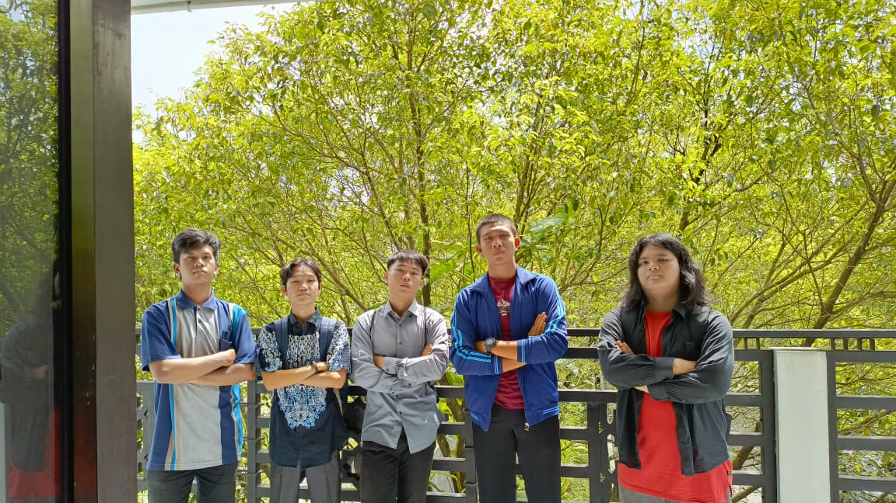
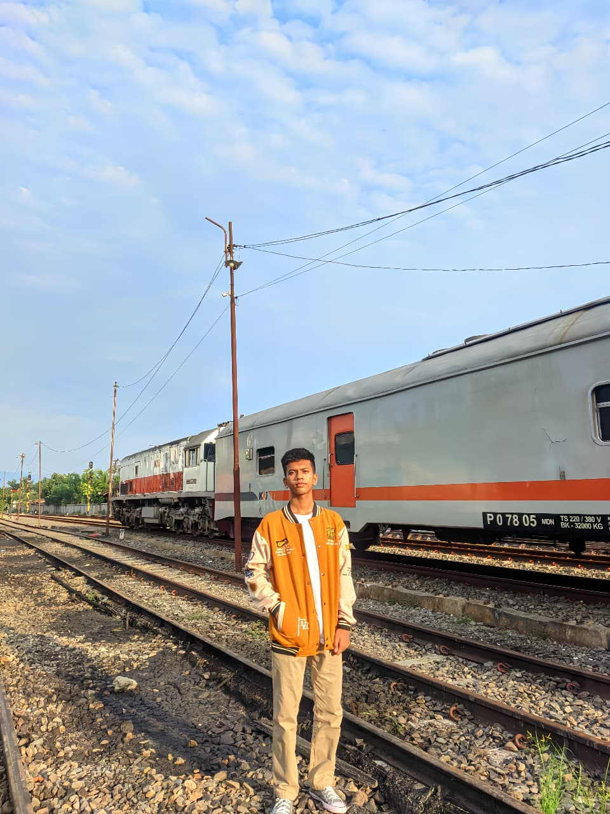
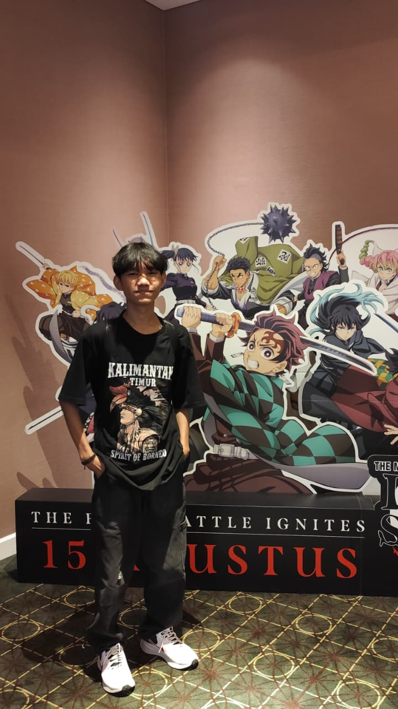
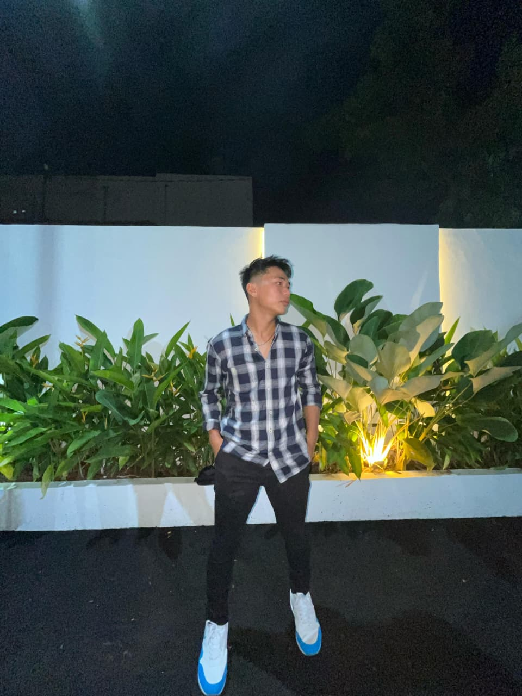
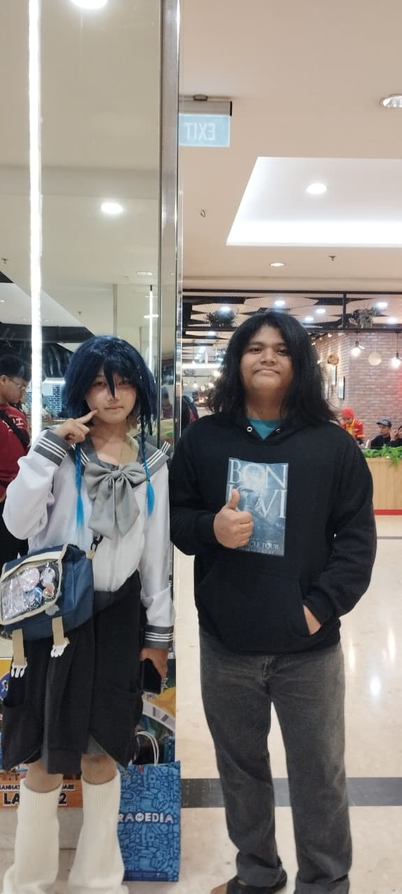
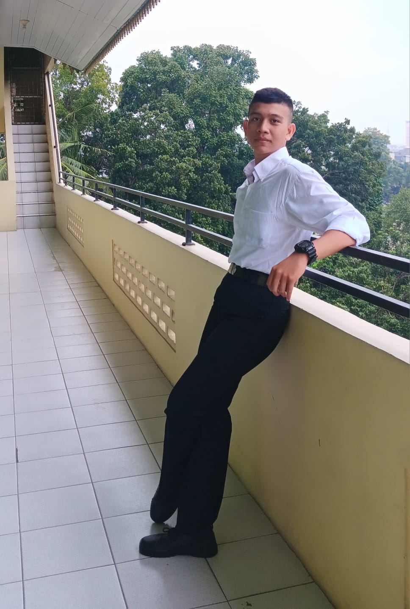
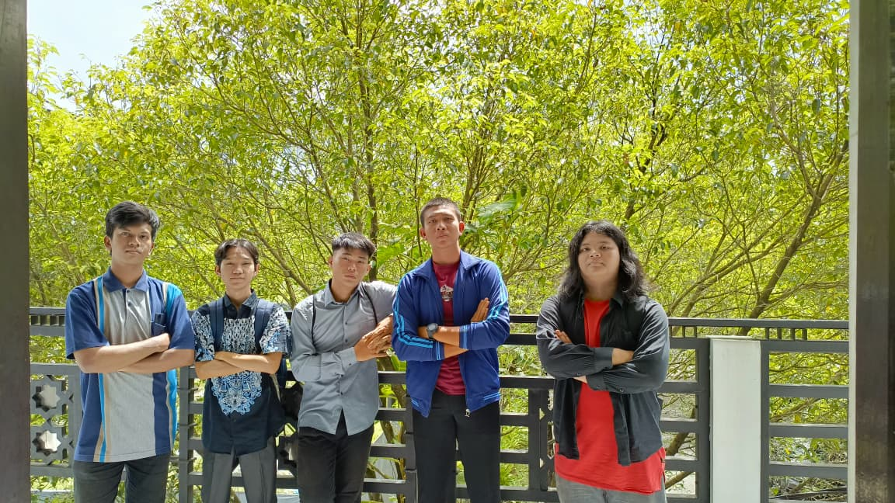

<!DOCTYPE html> 
<html lang="id"> 
<head> [kegiatan.html](https://github.com/user-attachments/files/24355432/kegiatan.html)

<meta charset="UTF-8"> 
<meta name="viewport" content="width=device-width, initial-scale=1.0"> 
<title> Kelompok Satu</title> 
 
</head> 
<body> 
<header> 
<a href="Website Kelompok.html" class="btn-kembali">← Kembali!</a>
<h1>Kegiatan Kelompok Satu</h1> 

Berisi tentang informasi Kegiatan dan Kinerja Kelompok Satu!
 
</header> 
<main>  
<section id="desain"> 
  <h2>Dokumentasi Kegiatan Kelompok Satu</h2> 
  
 Kegiatan Kami Dibuat Cinematic Agar Lebih Simple dan Kece, Kebetulan Salah Satu 
    Anggota Kelompok Bernama Muhammad Allansyah Merupakan Editor Berkelas.
 

  

    <video controls>
      <source src="Bersuara.mp4" type="video/mp4">
      Browser Anda tidak mendukung video.
    </video>
  

  </section>
<section id="perencanaan"> 

Setiap Tugas Yang Diberikan, Kelompok Kami Mempuyai Tugasnya Masing-Masing Untuk Mengerjakan Tugas
  Yang Diberikan Oleh Dosen Kami Sehingga Pembagian Tugas Dapat Merata dan Semua Anggota Kelompok Dapat
  Mengerjakan!

 
 

Gambar: Contoh wireframe untuk halaman utama, menunjukkan header, navigasi, 
dan area konten.
 
</section>
    </main> 
    <footer> 
        
&copy; 2023 Panduan Website. Dibuat dengan HTML & CSS.
 
    </footer> 
</body> 
</html>
<!DOCTYPE html> 
<html lang="id"> 
<head> 
<meta charset="UTF-8"> 
<meta name="viewport" content="width=device-width, initial-scale=1.0"> 
<title>Tentang Kami</title> 
 
</head> 
<body> 
<header> 
<a href="Website Kelompok.html" class="btn-kembali">← Kembali!</a>
<h1>Tentang Kelompok Satu</h1>

Berisi Informasi Mengenai Pembentukan Kelompok Satu!
 
</header> 
<main> 
    <section id="perencanaan"> 
<h2>Tentang Kami!</h2>

Kelompok Kami Adalah Kelompok Urutan Pertama Yang Ketuanya Dipilih Langsung Oleh Dosen Matakuliah Kami
   Dr.Solly Aryza,ST., M.Eng, Website ini Dibuat Untuk Menyelesaikan Tugas Website Kelompok. Anggota 
   Yang Ada Di Kelompok ini Dipilih Langsung Oleh Ketua Kelompok Kami Yaitu Arie Adha Nasution.

 
 
            
Gambar: Foto Kelompok Pertama
 
</section> 
</main>
    <footer> 
        
&copy; 2025 Panduan Website. Dibuat dengan HTML & CSS.
 
    </footer> 
</body> 
</html>
<!DOCTYPE html> 
<html lang="id"> 
<head> 
<meta charset="UTF-8"> 
<meta name="viewport" content="width=device-width, initial-scale=1.0"> 
<title> Kelompok Satu</title> 
 
</head> 
<body> 
<header> 
<h1>Website Kelompok Satu</h1> 

Berisi tentang informasi dan Dokumentasi Kelompok Satu!
 
</header> 
<nav> 
<a href="tentang.html">Tentang</a> 
<a href="foto kelompok.html">Foto Kami</a>
<a href="datadiri.html">Biodata</a> 
<a href="kegiatan.html">Kegiatan</a> 
</nav> 
<main> 
    <section id="perencanaan"> 
<h2>Selamat Datang di Website Kelompok Satu!</h2> 

Website Ini Adalah Website Kelompok Satu Dari Matakuliah Website Multimedia TIF Re1 B Universitas 
    Pancabudi. Website ini Berisikan Informasi Kegiatan, Foto dan Video Dari Kelompok Satu!

 
 
            
Gambar: Lingkungan Kampus Universitas Pancabudi.
 
</section>

    </main> 
         <footer> 
        
&copy; 2025 Panduan Website. Dibuat dengan HTML & CSS.
 
    </footer> 
</body> 
</html>
<!DOCTYPE html> 
<html lang="id"> 
<head> 
<meta charset="UTF-8"> 
<meta name="viewport" content="width=device-width, initial-scale=1.0"> 
<title>Tentang Kami</title> 
 
</head> 
<body> 
<header> 
<a href="Website Kelompok.html" class="btn-kembali">← Kembali!</a>
<h1>Data Diri Kelompok Satu</h1>

Berisi Informasi Mengenai Biodata Kelompok Satu!
 
</header> 
<main> 
    <section id="perencanaan"> 
<h2>Data Diri Ketua dan Anggota Kelompok Satu!</h2>

berisikan Informasi Mengenai Nama, Kelas, Hobi, Alamat, Alamat, Cita-cita, Asal SMA, 
   Instagram dan Makanan Kesukaan!
 

<table class="biodata"> 
<tr><th>Nama</th><td>Arie Adha Nasution</td></tr> 
<tr><th>Kelas</th><td>TIF Reg1B Website Multimedia</td></tr> 
<tr><th>Hobi</th><td>Game dan Traveling</td></tr> 
<tr><th>Alamat</th><td>JL. Cendana Atas N095. Rantau Prapat</td></tr> 
<tr><th>Cita-cita</th><td>Kondektur Kereta Api</td></tr> 
<tr><th>Asal SMA</th><td>SMK Negeri 14 Medan</td></tr>
</table> 
<h3>Tentang Saya</h3> 

Halo! Nama saya Arie. Saya Adalah Ketua Kelompk Dari Kelompok Satu!. Saya suka jalan-jalan 
   naik kereta api yaa bisa dibilang saya termasuk 
   railfans divre 1 sumut, nah selain jalan jalan saya juga suka bermain game online seperti 
   Wuthering waves, Pointblank, MLBB, Genshin Impact, dan Honkai Star Rail.
 

Kalau ada kesempatan saya biasanya daily game untuk sekedar hiburan atau kalau lagi ada uang
   saya jalan jalan
 

Impian saya adalah Bergabung di PT.KAI sebagai Kondektur Kereta Api.
 
<h3>Makanan Favorit</h3> 
<ul> 
<li>Mie Ayam Bakso Jumbo</li> 
<li>Ayam Richeese</li> 
<li>Napoleon Durian</li> 
</ul> 

Kunjungi Instagram saya: <a href="https://www.instagram.com/adhnstt?igsh=MThxZzZ3Y2Q0ajRnNg==">Klik di sini</a>

<table class="biodata"> 
<tr><th>Nama</th><td>Muhammad Allansyah</td></tr> 
<tr><th>Kelas</th><td>TIF Reg1B Website Multimedia</td></tr> 
<tr><th>Hobi</th><td>Game</td></tr> 
<tr><th>Alamat</th><td>Pangkalan Susu</td></tr> 
<tr><th>Cita-cita</th><td>Dewan Perwakilan Rakyat RI</td></tr>
<tr><th>Asal SMA</th><td>Sma Swasta Dharma Patra, Pangkalan Batu</td></tr>
</table> 
<h3>Tentang Saya</h3> 

Halo nama saya Allan, saya sangat suka dengan pembuatan animasi dan mendisain ui&ux.
 

Saya tinggal di pangkalan batu dan ke Universitas Pancabudi karena saya sangat 
   tertarik dengan jurusan Teknologi Informasi.
 

Tujuan saya adalah untuk mencapai gelar sarjana dan mendapatkan ilmu yang bermanfaat.
 
<h3>Makanan Favorit</h3> 
<ul> 
<li>Mie Ayam</li> 
<li>Ayam KFC</li> 
<li>Mpek-Mpek</li> 
</ul> 

Kunjungi Instagram saya: <a href="https://www.instagram.com/m_allensyah?igsh=a3Y3bGFvbnBycmw1m">Klik di sini</a>

<table class="biodata"> 
<tr><th>Nama</th><td>Khairul Ikhsan</td></tr> 
<tr><th>Kelas</th><td>TIF Reg1B Website Multimedia</td></tr> 
<tr><th>Hobi</th><td>Editing Video</td></tr> 
<tr><th>Alamat</th><td>Medan</td></tr> 
<tr><th>Cita-cita</th><td>Programmer</td></tr>
<tr><th>Asal SMA</th><td>Programmer</td></tr>
</table> 
<h3>Tentang Saya</h3> 

Halo! Nama saya Khairul. Saya suka belajar membuat Web dan Desain UI/UX

setiap hari saya belajar dan mencoba membuat desain-desain yang bagus dan menarik

moto saya, saya harus lebih bagus esok dari hari ini dan seterusnya

impian saya adalah ingin menjadi IT BANK

<h3>Makanan Favorit</h3> 
<ul> 
<li>Nasi Goreng</li> 
<li>Sate</li> 
<li>Soto</li> 
</ul> 

Kunjungi Instagram saya: <a href="https://www.instagram.com/khrllihsan__?igsh=MXJob3gwaGFtbGUzbQ==">Klik di sini</a>

<table class="biodata"> 
<tr><th>Nama</th><td>Muhammad Fadhil Harahap</td></tr> 
<tr><th>Kelas</th><td>TIF Reg1B Website Multimedia</td></tr> 
<tr><th>Hobi</th><td>game</td></tr> 
<tr><th>Alamat</th><td>Pangkalan Brandan</td></tr> 
<tr><th>Cita-cita</th><td>Dewan Perwakilan Rakyat RI</td></tr>
<tr><th>Asal SMA</th><td>Sma Swasta Dharma Patra, Pangkalan Batu</td></tr>
</table> 
<h3>Tentang Saya</h3> 

Hola! nama saya Fadhil. saya suka belajar membuat animasi dan desain grafis.
 

setiap hari saya mencoba membuat animasi mengunakan pensil 3D.
 

impian saya adalah menjadi anggota kominfo.
 
<h3>Makanan Favorit</h3> 
<ul> 
<li>Nasi Goreng Putih</li> 
<li>Nasi Goreng Daging Sate</li> 
<li>Nasi Goreng Merah</li> 
</ul> 

Kunjungi Instagram saya: <a href="https://www.instagram.com/konte3202/">Klik di sini</a>
 

<table class="biodata"> 
<tr><th>Nama</th><td>Ramses Morgana Surbakti</td></tr> 
<tr><th>Kelas</th><td>TIF Reg1B Website Multimedia</td></tr> 
<tr><th>Hobi</th><td>Membaca dan Lari</td></tr> 
<tr><th>Alamat</th><td>JL. Buntu Desa Lama Pancur Batu</td></tr> 
<tr><th>Cita-cita</th><td>Polisi</td></tr>
<tr><th>Asal SMA</th><td>SMA Negeri 1 Lubuk Pakam</td></tr> 
</table> 
<h3>Tentang Saya</h3> 

Halo! Nama saya Ramses. Saya suka belajar membuat Web dan Desain UI/UX

setiap hari saya belajar dan mencoba membuat desain-desain yang bagus dan menarik

moto saya, saya harus lebih bagus esok dari hari ini dan seterusnya

impian saya adalah menjadi anggota polisi bagian saiber

<h3>Makanan Favorit</h3> 
<ul> 
<li>Nasi Goreng</li> 
<li>Bakso</li> 
<li>Soto</li> 
</ul> 

Kunjungi Instagram saya: <a href="https://www.instagram.com/ramses_surbakti?igsh=MXVucWdsb3B2dW44ag==">Klik di sini</a>
 

</section> 
</main>
    <footer> 
        
&copy; 2025 Panduan Website. Dibuat dengan HTML & CSS.
 
    </footer> 
</body> 
</html>
<!DOCTYPE html> 
<html lang="id"> 
<head> 
<meta charset="UTF-8"> 
<meta name="viewport" content="width=device-width, initial-scale=1.0"> 
<title> Dokumentasi kelompok Satu</title> 
 
</head> 
<body> 
<header> 
<a href="Website Kelompok.html" class="btn-kembali">← Kembali!</a>
<h1>Dokumentasi Kelompok Satu</h1>

Berisi Foto-Foto Ketua dan Anggota Kelompok Satu!
 
</header> 
<main>  
        <section id="desain"> 
            <h2>Dokumentasi Foto Kelompok Pertama!</h2> 
            
Dokumentasi ini Hanya Berisi Foto-Foto Ketua dan Anggota Dari Kelompok Pertama.
 
             
            
Foto Bareng Bersama Anggota Kelompok Pertama Di Kelas
 
             
            
Gambar: Foto Bersama Ketua dan Anggota di Gedung M.
 
        </section> 
    </main> 
     
    <footer> 
        
&copy; 2025 Panduan Website. Dibuat dengan HTML & CSS.
 
    </footer> 
</body> 
</html>
